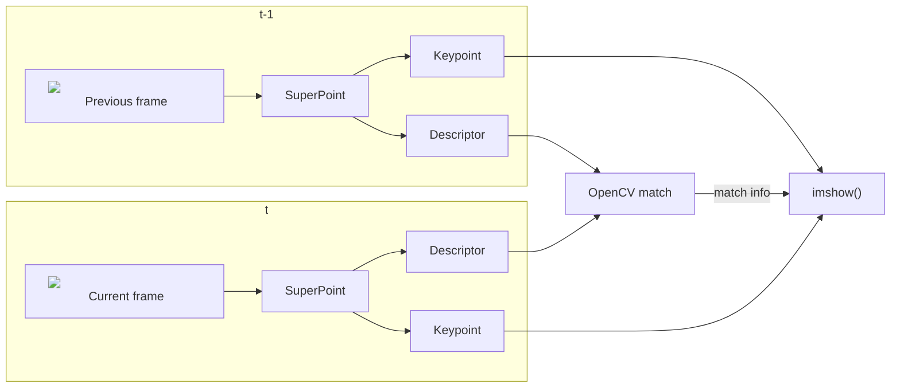

<!-- 
原則上建議所有內容以中文撰寫，但不限制。
以下內容除標題外，其餘皆為輔助填寫說明，如有需要可自行調整項目及細節表達方式
-->

# NTUST Edge AI 111-02 期末專題報告

# 系所年級_學號_姓名

# 1. 作品名稱

深度學習特徵點提取

# 2. 摘要說明

<!-- 
這部份以100~200字，說明創作理念、硬體架構、模型選用、訓練成效、優化過程及最終結果比較。 -->

## 創作理念

### VSLAM

視覺SLAM（Visual SLAM）系統是一種使用圖像資訊(Visual)進行同時定位與地圖構建(SLAM, Simutaniously Localization And Mapping)的技術。它通過分析如輸入圖像的特徵等資訊，估計相機的/無人機/自駕車的位置並同時建立周圍環境的地圖。視覺SLAM廣泛應用於導航(尤其是無地圖資料時，可用於初步地建立地圖)、AR、VR等領域。

* 優勢：使用相對便宜且常見的相機感測器進行環境感知。
* 劣勢: 對環境變化敏感。VSLAM的性能易受傳統電腦視覺中常見的問題而影像其定位或是建圖的性能。例如，光照變化、場景結構變化或動態物體的存在可能使得特徵點提取和匹配變得困難。

### 深度學習特徵點提取

相對於傳統的手工設計特徵提取方法，深度學習特徵點提取具有以下優勢：

1. 可從大量數據中學習到更具判別性和鑑別性的特徵描述子。
2. 不依賴於先驗知識，能夠自動學習適應不同任務，更具泛化能力。

在VSLAM的應用中，傳統的視覺SLAM方法依賴於手工設計的特徵，如SIFT或ORB等，但他們容易受到環境變化的影響，導致定位和地圖構建的不穩定性。深度學習特徵點提取通過學習適應性的特徵表示，能夠更好地應對環境變化，提高視覺SLAM系統的robustness和準確性。

# 3. 系統簡介

<!-- 
至少一張結果示意影像作為代表圖示。
-->

<!-- <figure>

<figcaption>SuperPoint: 全卷積神經網絡，可同時計算 2D 興關鍵點位置和描述子</figcaption>

</figure> -->

TODO: draw pic like this

## 3.1 創作發想

<!-- 
請簡單說明為何創作（如受某篇論文或某項網路作品激發、生活上常遇到問題、市場缺乏對應解決方案等等）
預期解決何種問題（分類、物件偵測、影像分割、時序預測、人臉辨識、姿態估測、模型壓縮等）及目前存在解決方案及不足的地方。
預期系統完成後可達目標（如節省人力、提高辨識精度、改善生活等等）
-->

傳統的特徵(點)提取方式容易受到光線變化的影響，如：動態的光照(閃爍的燈光、機載光源(onboard illumination))、較強的雜訊等。希望藉由深度學習的技術來讓所提取的特徵在光照變化的環境下更加穩定，並減少誤匹配的情況發生。

期望能藉由深度學習特徵點提取模型(SuperPoint)搭配之後的 SLAM 演算法研究，使的整體 VSLAM 演算法的表現、robustness 能夠比以往的演算法更佳。

## 3.2 軟硬體架構

<!-- 
說明使用硬體（如筆電、網路攝影機、麥克風、樹莓派、Jetson Nano、Arduino Nano 33 BLE Sense及其它各種輸入、輸出裝置或通訊界面等等）、連接方式及軟體階層說明等。
-->

Trainging Hardware:

|Hardware type|Model/Spec|
|---|---|
|Memory|32GB|
|CPU|i7-11700 @ 2.5GHz|
|GPU|NVIDIA GeForce RTX 3090| 

Software environment: 

Host: 

|Software|Version|
|---|---|
|NVIDIA GPU Driver(`nvidia.ko`)|470.182.03|
|CUDA Driver(`libcuda.so`)|470.182.03|
|NVIDIA Container toolkit(`nvidia-ctk`)|1.13.1| 
|Docker| 20.10.21|

Container: 
* Based on `nvidia/cuda:11.3.1-cudnn8-runtime-ubuntu20.04`
* [Dockerfile](https://github.com/hihi313/Practice-of-Edge-Intelligence-and-Computing/blob/master/docker/Dockerfile)

|Software|Dependencies|
|---|---|
|apt|[apt_packages.text](https://github.com/hihi313/Practice-of-Edge-Intelligence-and-Computing/blob/master/docker/apt_packages.txt)|
|pip|[requirements](https://github.com/hihi313/Practice-of-Edge-Intelligence-and-Computing/blob/master/docker/requirements.txt)|

## 3.3 工作原理及流程

<!-- 
簡述輸入及輸出架構（如使用網路攝影機作為輸入，經過XXX硬體計算後，在螢幕或其它輸出裝置顯示結果），最好能給出一張簡單流程圖。
-->

測試方式為: 在一個迴圈內，對目前的輸入圖像輸入至 SuperPoint 深度學習特徵提取網路內，經由網路(和後處理後)提取特徵點的位置以及其對應描述子。經過轉換後直接使用 OpenCV 的(任意)特徵批配方法，以描述子 L2 距離取最接近的作為批配的點。最後再經由 OpenCV 將批配的結果畫在當前幀以及前一幀上。

<figure>

<figcaption>SuperPoint 在自行錄製的資料集上進行推論，經 OpenCV 批配的結果</figcaption>

</figure>

## 3.4 資料集建立方式

<!-- 
說明如何建置資料集，是採用公開或自定義資料集。
如何收集資料集及資料集數量統計說明
-->

### 資料蒐集

<figure>

<figcaption>台科 EE 7 樓錄製的資料序列</figcaption>

</figure>

<figure>

<figcaption>台科 TR 9 樓錄製的資料序列</figcaption>

</figure>

預訓練模型使用 MS-COCO 2014 資料集，並取訓練90000 個 epoch 的模型作為預訓練模型 fine-tune。Fine-tune 模型則使用自建資料集，蒐集台科 TR 9 樓 和 EE 大樓 7 樓的場景

自建資料集: 
* 主要使用樹梅派的(魚眼)相機進行錄製，如上圖
* 手動分成訓練、驗證、測試資料集，以符合 COCO 資料集的格式。比例分別約為 8:1:1
* 訓練資料數量: 3970
* 驗證資料數量: 496
* 測試資料數量: 501

### 資料標注

<figure>

<figcaption>SuperPoint 自監督資料標注/訓練流程</figcaption>

</figure>

<figure>

<figcaption>Homographic adaptaion 示意圖</figcaption>

</figure>

Superpoint 論文中的自監督資料標注流程:

1. 生成虛擬/合成影像，並將已知的角/特徵點作為 ground truth 並訓練 SuperPoint 網路中的 detector
    * 不訓練 descriptor，即網路下半部，論文中稱此網路為 magicpoint
    * 生成如: 棋盤格、點、線段、2D/3D 多面體等，並在背景加入一些 noise 以提高 robustness
2. 因用虛擬影像訓練的網路在真實世界的泛化能力不足，因此透過如: Homography 等變換方式，將同張真實世界的圖經變換後所找到的所有點作為此張圖的特徵點 ground truth
    * 論文中稱為: homographic adaptation
    * 論文中稱生成的 groud truth 為: pseudo ground truth
3. 利用前步驟自監督生成的 ground truth，將真實圖像經變換(如: homography, Gaussian blur 等)，同時訓練全部網路(訓練 point detector 以及 point descriptor extractor)

實際標注流程: 

1. 第一部份直接使用預訓練的網路(magicpoint)
2. 使用預訓練 magicpoint 生成自建資料集的 pseudo ground truth
3. 使用自建資料集的圖片與 pseudo ground truth 對預訓練的網路進行 fine-tune

## 3.5 模型選用與訓練

<!-- 
簡述使用公開模型或自定義模型原因
是否重新訓練及相關參數設定等
-->

<figure>

<figcaption>論文中的 SuperPoint 架構圖</figcaption>

</figure>

實際模型架構，用 tensorboard 繪製 (圖大)

<figure>

<figcaption>SuperPoint 架構</figcaption>

</figure>

<figure>

<figcaption>incvon block 架構</figcaption>

</figure>

<figure>

<figcaption>down block 架構</figcaption>

</figure>

# 4. 實驗結果

## 4.1 測試與比較

<!-- 
說明基本實驗結果及對比其它模型或解決方案的差異。
-->

TODO: test on tr9 or ee7

TOTO: test on laptop

## 4.2 改進與優化

<!-- 
如原來使用Nvidia GPU+PyTorch結果和經Intel OpenVINO優化後，模型壓縮大小、推論精度與速度比較。
或以不同參數找出最佳解過程。
-->

# 5. 結論

# 6. 參考資料

<!-- 
參考論文1
外部資料集及標註檔
-->

# 7. 附錄

<!-- 
公開源碼連結
其它說明內容
-->
