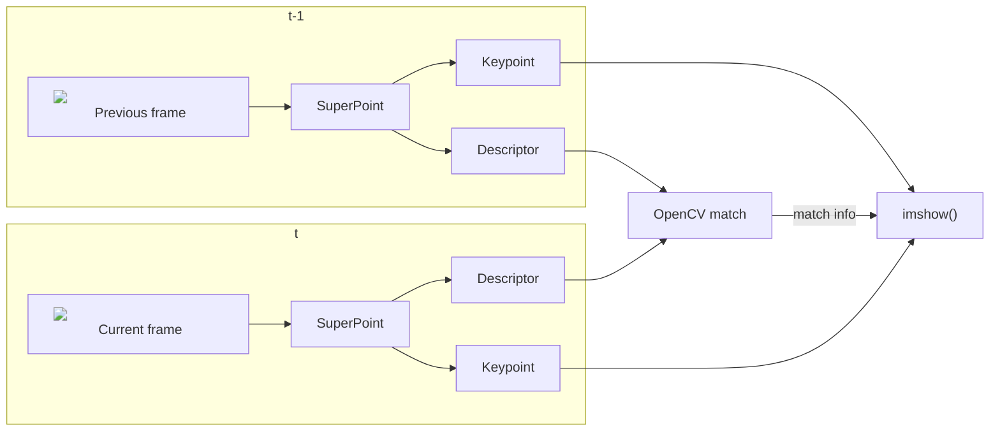

<!-- 
原則上建議所有內容以中文撰寫，但不限制。
以下內容除標題外，其餘皆為輔助填寫說明，如有需要可自行調整項目及細節表達方式
-->

# NTUST Edge AI 111-02 期末專題報告

# 1. 作品名稱

深度學習特徵點提取

# 2. 摘要說明

<!-- 
這部份以100~200字，說明創作理念、硬體架構、模型選用、訓練成效、優化過程及最終結果比較。 -->

## 創作理念

### VSLAM

視覺SLAM（Visual SLAM）系統是一種使用圖像資訊(Visual)進行同時定位與地圖構建(SLAM, Simutaniously Localization And Mapping)的技術。它通過分析如輸入圖像的特徵等資訊，估計相機的/無人機/自駕車的位置並同時建立周圍環境的地圖。視覺SLAM廣泛應用於導航(尤其是無地圖資料時，可用於初步地建立地圖)、AR、VR等領域。

* 優勢：使用相對便宜且常見的相機感測器進行環境感知。
* 劣勢: 對環境變化敏感。VSLAM的性能易受傳統電腦視覺中常見的問題而影像其定位或是建圖的性能。例如，光照變化、場景結構變化或動態物體的存在可能使得特徵點提取和匹配變得困難。

### 深度學習特徵點提取

相對於傳統的手工設計特徵提取方法，深度學習特徵點提取具有以下優勢：

1. 可從大量數據中學習到更具判別性和鑑別性的特徵描述子。
2. 不依賴於先驗知識，能夠自動學習適應不同任務，更具泛化能力。

在VSLAM的應用中，傳統的視覺SLAM方法依賴於手工設計的特徵，如SIFT或ORB等，但他們容易受到環境變化的影響，導致定位和地圖構建的不穩定性。深度學習特徵點提取通過學習適應性的特徵表示，能夠更好地應對環境變化，提高視覺SLAM系統的robustness和準確性。

# 3. 系統簡介

<!-- 
至少一張結果示意影像作為代表圖示。
-->

<figure>

<figcaption>SuperPoint: 全卷積神經網絡，可同時計算 2D 興關鍵點位置和描述子</figcaption>

</figure>

## 3.1 創作發想

<!-- 
請簡單說明為何創作（如受某篇論文或某項網路作品激發、生活上常遇到問題、市場缺乏對應解決方案等等）
預期解決何種問題（分類、物件偵測、影像分割、時序預測、人臉辨識、姿態估測、模型壓縮等）及目前存在解決方案及不足的地方。
預期系統完成後可達目標（如節省人力、提高辨識精度、改善生活等等）
-->

傳統的特徵(點)提取方式容易受到光線變化的影響，如：動態的光照(閃爍的燈光、機載光源(onboard illumination))、較強的雜訊等。希望藉由深度學習的技術來讓所提取的特徵在光照變化的環境下更加穩定，並減少誤匹配的情況發生。

期望能藉由深度學習特徵點提取模型(SuperPoint)搭配之後的 SLAM 演算法研究，使的整體 VSLAM 演算法的表現、robustness 能夠比以往的演算法更佳。

## 3.2 軟硬體架構

<!-- 
說明使用硬體（如筆電、網路攝影機、麥克風、樹莓派、Jetson Nano、Arduino Nano 33 BLE Sense及其它各種輸入、輸出裝置或通訊界面等等）、連接方式及軟體階層說明等。
-->

Trainging/testing hardware(1):

|Hardware type|Model/Spec|
|---|---|
|Memory|32GB|
|CPU|i7-11700 @ 2.5GHz|
|GPU|NVIDIA GeForce RTX 3090| 

Testing hardware(2):
* 主要用於測試執行時間
* MacBook Air 2020

|Hardware type|Model/Spec|
|---|---|
|Memory|8GB/2GB swap (in container)|
|CPU|i5-1030NG7 @ 1.1GHz|
|GPU|N/A (not used in container)| 

Software environment: 

Host(1): 

|Software|Version|
|---|---|
|OS|Ubuntu 20.04|
|NVIDIA GPU Driver(`nvidia.ko`)|470.182.03|
|CUDA Driver(`libcuda.so`)|470.182.03|
|NVIDIA Container toolkit(`nvidia-ctk`)|1.13.1| 
|Docker| 20.10.21|

Host(2): 

|Software|Version|
|---|---|
|OS|MacOS 12.6.2|
|NVIDIA GPU Driver(`nvidia.ko`)|N/A|
|CUDA Driver(`libcuda.so`)|N/A|
|NVIDIA Container toolkit(`nvidia-ctk`)|N/A| 
|Docker| 20.10.22 |

Container: 
* Based on `nvidia/cuda:11.3.1-cudnn8-runtime-ubuntu20.04`
* [Dockerfile](./docker/Dockerfile)

|Software|Dependencies|
|---|---|
|apt|[apt_packages.text](./docker/apt_packages.txt)|
|pip|[requirements](./docker/requirements.txt)|

## 3.3 工作原理及流程

<!-- 
簡述輸入及輸出架構（如使用網路攝影機作為輸入，經過XXX硬體計算後，在螢幕或其它輸出裝置顯示結果），最好能給出一張簡單流程圖。
-->

測試方式為: 在一個迴圈內，對目前的輸入圖像輸入至 SuperPoint 深度學習特徵提取網路內，經由網路(和後處理後)提取特徵點的位置以及其對應描述子。經過轉換後直接使用 OpenCV 的特徵匹配方法，以描述子 L2 距離取最接近的作為匹配的點。最後再經由 OpenCV 將匹配的結果畫在當前幀以及前一幀上。

<figure>

<figcaption>SuperPoint 在自行錄製的資料集上進行推論，經 OpenCV 匹配的結果</figcaption>

</figure>

## 3.4 資料集建立方式

<!-- 
說明如何建置資料集，是採用公開或自定義資料集。
如何收集資料集及資料集數量統計說明
-->

### 資料蒐集

<figure>

<figcaption>台科 EE 7 樓錄製的資料序列</figcaption>

</figure>

<figure>

<figcaption>台科 TR 9 樓錄製的資料序列</figcaption>

</figure>

第一次訓練模型使用 MS-COCO val2017 資料集，並取其訓練後的模型做 fine-tune。Fine-tune 模型則使用自建資料集，蒐集台科 TR 9 樓 和 EE 大樓 7 樓的場景

MS-COCO val2017 資料集: 
* 因在參考的 [Github repo][1] 中使用的資料集(MS-COCO 2014)太大，考量到有自建資料集進行 fine-tune，且訓練時會做類似資料擴增(data augmentation) 的 homography transform，資料數量應足夠，所以選擇資料集大小較小的 MS-COCO val2017
* 共 5000 張圖片
* 手動分成訓練、驗證，以符合 COCO 資料集的格式。比例分別約為 8:2
    * 考量有自建資料集，以及其他的資料集，因此沒有再分出測試資料集

自建資料集: 
* 主要使用樹梅派的(魚眼)相機進行錄製，如上圖
* 手動分成訓練、驗證、測試資料集，以符合 COCO 資料集的格式。比例分別約為 8:1:1
* 訓練資料數量: 3970
* 驗證資料數量: 496
* 測試資料數量: 501

### 資料標注

<figure>

<figcaption>SuperPoint 自監督資料標注/訓練流程</figcaption>

</figure>

<figure>

<figcaption>Homographic adaptaion 示意圖</figcaption>

</figure>

Superpoint 論文中的自監督資料標注流程:

1. 生成虛擬/合成影像，並將已知的角/特徵點作為 ground truth 並訓練 SuperPoint 網路中的 detector
    * 不訓練 descriptor，即網路下半部，論文中稱此網路為 magicpoint
    * 生成如: 棋盤格、點、線段、2D/3D 多面體等，並在背景加入一些 noise 以提高 robustness
2. 因用虛擬影像訓練的網路在真實世界的泛化能力不足，因此透過如: Homography 等變換方式，將同張真實世界的圖經變換後所找到的所有點作為此張圖的特徵點 ground truth
    * 論文中稱為: homographic adaptation
    * 論文中稱生成的 groud truth 為: pseudo ground truth
3. 利用前步驟自監督生成的 ground truth，將真實圖像經變換(如: homography, Gaussian blur 等)，同時訓練全部網路(訓練 point detector 以及 point descriptor extractor)

<figure>

<figcaption>使用預訓練 magicpoint 網路在 MS-COCO val2017 資料集的圖片進行 Self-supervise 產生的 label</figcaption>

</figure>

實際標注流程: 

1. 第一部份直接使用預[訓練的 magicpoint 網路][3]
2. 使用[預訓練 magicpoint][3] 生成自建資料集以及 MS-COCO val2017 的 pseudo ground truth

<figure>

<figcaption>使用預訓練 magicpoint 網路在自行錄製資料集(EE7)標記的 label</figcaption>

</figure>

<figure>

<figcaption>使用預訓練 magicpoint 網路在自行錄製資料集(TR9)標記的 label</figcaption>

</figure>

## 3.5 模型選用與訓練

<!-- 
簡述使用公開模型或自定義模型原因
是否重新訓練及相關參數設定等
-->

### 模型

<figure>

<figcaption>論文中的 SuperPoint 架構圖</figcaption>

</figure>

實際模型架構，用 tensorboard 繪製 (圖大)

<figure>

<figcaption>SuperPoint 架構</figcaption>

</figure>

<figure>

<figcaption>incvon block 架構</figcaption>

</figure>

<figure>

<figcaption>down block 架構</figcaption>

</figure>

### 訓練

共分為 2 部份/步驟做訓練: 

1. 使用在 MS-COCO val2017 對模型做初步訓練
2. Fine-tune 使用自建資料集

<figure>

<figcaption>訓練 loss。灰色: 使用 COCO dataset，橘色: 使用自建資料集</figcaption>

</figure>

# 4. 實驗結果

## 4.1 測試與比較

<!-- 
說明基本實驗結果及對比其它模型或解決方案的差異。
-->

> 匹配(match): 使用 OpenCV 對特徵點描述子做匹配時，使用 L2 距離作為匹配的指標，並通過 ratio test (參考自 OpenCV 的官方教學)，篩選最近距離(的描述子) < 第二近距離 0.7 倍的點，符合此條件的點才視為匹配。隱含的意思是: 相近的點的距離要夠近，不相似的點的距離需要夠遠

> outlier: 使用 OpenCV 以 RANSAC 方式估計 fundamental 矩陣 F。設某匹配點對於上一幀的位置 x，當前幀的位置 x'，則 l'=x'=Fx (對極幾何約束(epipolar constraint)，l'為極線(epipolar line))。所以若 x 在當前幀的點位置 x' 與 l' 距離過大則視為 outlier。實驗時以參數 `--f_rej_th` 設定為 5 (除非另有標示)。
> 另外，雖然場景中的動態物體也會讓誤差值較大。但若正確批配的話，理論上不論何種特徵提取方式都會受到影響。

> `f_rej_th`: 實驗過程中發現此閥值若使用預設的 3，SuperPoint 的 `outlier_prec` 很像會比較高，故設(SuperPoint 及 SIFT 的閥值皆) 為 5。推測是因為 SuperPoint 提取的特稱點的熱點圖直接使用 `max_pool` 的方式達到 NMS 的效果，所以在精度上最多只能達到像素級別。而觀察 OpenCV SIFT 的特徵點位置輸出，則其可達到 subpixel 的精度。因為目前的目標並沒有要測試其精度，目的是找出誤差較大的誤匹配，故將此閥值調高。

### 模型表現

主要以 3 個資料集進行測試與比較。除了自建資料集，選擇有動態環境光(dynamic illumination)較多的場景，希望能測試深度學習方法和傳統方法之間在此情境的差距。輸入圖片大小固定為 240\*320(H\*W)。
1. [HISLAB][12]
    * 自建資料集中的測試資料集，與訓練資料集同一個場景(EE7, TR9)。中間**場景有切換**(第199、200幀之間)，故匹配的比例驟降，以及 outlier 比例驟升。
2. [OIVIO OD_015_HH_03][10]
    * 手持設備並搭載照明系統拍攝的公開資料集，主要用於測試機載照明設備所造成的動態環境光對於特徵提取的影響
    * 
3. [TartanAir ocean hard P009][11]
    * 電腦模擬生成的資料集。水面變化會造成水下場景光線變化。電腦生成的魚類可能會造成小區域 repeated pattern，希望也能藉此測試深度學習方法和傳統方法的差異，以及深度學習方法是否能克服此問題。
    * 

因為後續希望應用在 SLAM 的系統中，所以比較的指標如下:

> SuperPoint 每個序列都有測不同的版本(torch+CPU, torch+GPU, ONNX, OpenVINO)，故有多筆資料

#### 匹配比例

* `match_prec`
* 越高越好
* (與上一幀)匹配的數量/(當前幀)特徵點數量。若當前幀無特徵點則設為0(0%)

<figure>

<figcaption>在 HISLAB 測試資料集序列上的匹配比例</figcaption>

</figure>

<figure>

<figcaption>在 OIVIO OD_015_HH_03 測試資料集序列上的匹配比例</figcaption>

</figure>

<figure>

<figcaption>在 TartanAir ocean hard P009 測試資料集序列上的匹配比例</figcaption>

</figure>

可以發現，透過批配時的 ratio test，SuperPoint 能夠將正例以及負例的 L2 距離拉開，進而使更多的點對批配成功。這也表明在論文中的 loss function 是有效的

> 論文中的 descriptor loss: $l_d\left(\mathbf{d}, \mathbf{d}^{\prime} ; s\right)=\lambda_d * s * \max \left(0, m_p-\mathbf{d}^T \mathbf{d}^{\prime}\right) +(1-s) * \max \left(0, \mathbf{d}^T \mathbf{d}^{\prime}-m_n\right)$，$\lambda_d$ 代表負例 loss 的權重

#### outlier 比例

* `outlier_prec`
* 越低越好
* outlier 數量/匹配數量。若無匹配則設為1(100%)
    <!-- * (部份實驗設錯為100，變成10000%。所以若有超過1(100%)者，實際意義仍為100%) -->

<figure>

<figcaption>在 HISLAB 測試資料集序列上的 outlier 比例</figcaption>

</figure> 

<figure>

<figcaption>在 OIVIO OD_015_HH_03 測試資料集序列上的 outlier 比例，都約為 10% 以內。</figcaption>

</figure>

<figure>

<figcaption>在 TartanAir ocean hard P009 測試資料集序列上的 outlier 比例</figcaption>

</figure>

除了一般光線的環境下，不論是用深度學習方法或是傳統方法，outlier 的比例都差不多。但到了環境光變化較大的序列則體現深度學習方法的優勢。

#### 特徵點數量

* `num_kp`
* 一般情況下通常不會參考，因為 SuperPoint 模型架構的設計方式基本上最多每 8\*8 個 pixel 取一個特徵點，故特徵點數量相較於比較對象 SIFT 可能會比較少。但若 SuperPoint 提取特徵點數量明顯多於 SIFT ，則表示在這些場景下，SuperPoint 仍能有效提取場中的特徵。

<figure>

<figcaption>在 HISLAB 測試資料集序列上的特徵點數量</figcaption>

</figure>

<figure>

<figcaption>在 OIVIO OD_015_HH_03 測試資料集序列上的特徵點數量</figcaption>

</figure>

<figure>

<figcaption>在 TartanAir ocean hard P009 測試資料集序列上的特徵點數量</figcaption>

</figure>

在 TartanAir ocean 的環境下，傳統方式表現較差。推測是因為對比度較低，故傳統方法無法在沒有 histogram equalization 前處理下提取特徵。

## 4.2 改進與優化

<!-- 
如原來使用Nvidia GPU+PyTorch結果和經Intel OpenVINO優化後，模型壓縮大小、推論精度與速度比較。
或以不同參數找出最佳解過程。
-->

### 推論精度

由上面的比較可知，在經過 OpenVINO 優化以後的模型在以上幾個指標下的差異不大

> 使用的 OpenVINO 優化指令: `mo --compress_to_fp16 --input_model "${1}" --output_dir "${OUTPUT_DIR}"`

#### 不同訓練方式比較

以下比較 3 種訓練方式所得到的模型間的差異:
1. `60k_COCO`
    * 在 MS-COCO val 2017 資料集上做訓練的模型。如上訓練 loss 圖中的灰色線
    * 因發現訓練時 loss 有回彈，故選用回彈前的模型
2. `35k_finetune`
    * 基於 `60k_COCO` 再使用自建資料集進行 fine-tune 的模型。如上訓練 loss 圖中的橘色線
    * 放大 validation 和 training loss 之後發現有些微的 overfitting，故選用 overfitting 前的模型。
    * (實驗基本上皆基於此模型)
3. `80k_preAndFine`
    * 先前實驗時所紀錄的模型，基於在 MS-COCO 2014 資料集上訓練約 90k 的 pre-train 模型，再令其在自建資料集上進行 fine-tune ，訓練約 80k 後所得到的模型

<figure>

<figcaption>在 HISLAB 測試資料集序列上的特徵點數量</figcaption>

</figure>

<figure>

<figcaption>在 HISLAB 測試資料集序列上的批配比例</figcaption>

</figure>

<figure>

<figcaption>在 HISLAB 測試資料集序列上的 outlier 比例</figcaption>

</figure>

由上圖中可知，基本上的趨勢為: 訓練越多次對於所找到的特徵點數量有些為增加，例如: `60k_COCO` 對比於 `35k_finetune` 而言，特徵點提取的數量有較明顯的增加，而 `80k_preAndFine` 對比於 `35k_finetune` 在訓練更多次後則增加的趨勢區緩。而對於特徵點描述子的改進，以匹配比例以及 outlier 比例的指標來看，相對於特徵點數量而言，並沒有較明顯的進步。因此，模型在訓練後期很有可能主要在學習找到特徵點的位置或是將特徵點的位置對齊 ground truth。這也能從訓練時的 log 圖片中觀察到:

<figure>

<figcaption>在 HISLAB 訓練資料集序列上訓練 200k 的 log。模型輸出的 heatmap 經過 NMS 後的結果(綠色點)，與 (pseudo) ground truth 經過 NMS 後的結果(紅色點)，繪製在訓練圖片上的結果。(若輸出和 ground truth 點有重合，點會呈現黃色，但較少且不明顯)</figcaption>

</figure>

<figure>

<figcaption>SuperPoint loss 組成</figcaption>

</figure>

而且，loss 的組成為: `loss` = `loss_det` + `loss_det_wrap` + 1*(1*`positive_dest` + `negative_dist`)，所以若特徵點位置相關的 loss(`loss_det`,`loss_det_wrap`)較大，則整體 loss 也大。
在途中約 20k 到 40k 之間，descriptor 相關的 loss (`positive_dest`, `negative_dist`) 基本上變動不大，而位置相關的 loss 下降較多，因此 descriptor 相關 loss 收斂的速度較位置相關 loss 快。

### 推論速度

> 計算推論速度包含前處理、推論、後處理(對模型輸出 heatmap 做 NMS 等)，不包含計算以上 metric、繪圖、顯示等時間。SIFT 無後處理

<figure>

<figcaption>在 hardware (1) 上，於 HISLAB 測試資料集序列上，各種模型的執行時間</figcaption>

</figure>

<figure>

<figcaption>在 hardware (1)(暖色系) 和 (2)(冷色系) 上，於 HISLAB 測試資料集序列上，各種模型的執行時間比較</figcaption>

</figure>

<figure>

<figcaption>在 hardware (1)(暖色系) 和 (2)(冷色系) 上，於 HISLAB 測試資料集序列上，SIFT 的執行時間比較</figcaption>

</figure>

基本上在 hardware (2) 上，不論有無優化，模型的執行速度都約為 1~2 FPS，只能說能跑。但其中有幾點觀察發現:
1. 在 hardware (1) 上，OpenVINO 的優化對比於直接使用 ONNX 模型進行 inference，差別並不大，似乎只要不是用 pytorch+CPU 執行就會比較快
2. 而在 hardware (2) 上，pytorch+CPU 的模型反而比 OpenVINO 和 ONNX 快，目前不知道原因為何，GitHub 上也有相關 [issue][2] 但似乎仍沒有很好的解決/解釋。

# 5. 結論

SuperPoint 對比於傳統的特徵提取演算法而言，在有 dynamic illumination 或是 repeated pattern 的情況下會有比較好的表現。但仍有幾點仍能夠改進之處:
1. 最多只能在 8\*8 的區域中有一個特徵點，造成特徵點較少。
2. NMS 使用 `max_pool`，造成特徵點位置的精度不足。
    * 若輸出會當成是後續深度學習模型的一部分輸入，或許直接使用 heatmap 較能有更多且精確的資訊。
3. 特徵點位置相關的 loss 後期收斂速度較慢，如實驗所示，需要訓練更多次才能讓特徵點數量上升。

# 6. 參考資料

<!-- 
參考論文1
外部資料集及標註檔
-->

1. [Superpoint: Self-supervised interest point detection and description][4]
2. [MS-COCO val2017][5]
3. [eric-yyjau / pytorch-superpoint][1]
    * 修改並用於訓練
4. [magicleap/SuperPointPretrainedNetwork][6]
    * 參考後處理以及顯示結果 code
5. [magicleap/SuperGluePretrainedNetwork][7]
    * 參考後處理 code
6. [TartanAir ocean dataset][11]
7. [OIVIO outdoor dataset][10]

# 7. 附錄

<!-- 
公開源碼連結
其它說明內容
-->

1. [GitHub repo][8]
2. [SuperPoint GitHub repo][9]

[1]: https://github.com/eric-yyjau/pytorch-superpoint "eric-yyjau / pytorch-superpoint"
[2]: https://github.com/ultralytics/yolov5/issues/6607 "Why is the inference speed of Yolov5 PyTorch model (with raw uint8 images) better than ONNX and OpenVino models"
[3]: https://github.com/eric-yyjau/pytorch-superpoint/blob/master/logs/magicpoint_synth_t2/checkpoints/superPointNet_100000_checkpoint.pth.tar "Pre-trained SuperPoint"
[4]: https://openaccess.thecvf.com/content_cvpr_2018_workshops/w9/html/DeTone_SuperPoint_Self-Supervised_Interest_CVPR_2018_paper.html "SuperPoint"
[5]: https://images.cocodataset.org/zips/val2017.zip "MS-COCO val2017"
[6]: https://github.com/magicleap/SuperPointPretrainedNetwork "Pretrained SuperPoint"
[7]: https://github.com/magicleap/SuperGluePretrainedNetwork "Pretrained SuperGlue"
[8]: https://github.com/hihi313/Practice-of-Edge-Intelligence-and-Computing "My GitHub repo"
[9]: https://github.com/hihi313/pytorch-superpoint/tree/master "SuperPoint GitHub repo"
[10]: https://drive.google.com/a/colorado.edu/uc?id=1jAEX3X4836h_7avQl0xFKGl-8Wy1zocO&export=download "OIVIO OD_015_HH_03.tar.gz"
[11]: https://tartanair.blob.core.windows.net/tartanair-release1/ocean/Hard/image_left.zip "TartanAir ocean hard"
[12]: https://mailntustedutw-my.sharepoint.com/:u:/g/personal/m10902117_ms_ntust_edu_tw/EfpdClPAuAtPg55QqhHU0GUBUN0DY2Y68Vb1JA3P5NuWgw?e=b1MLOY "HISLAB dataset"